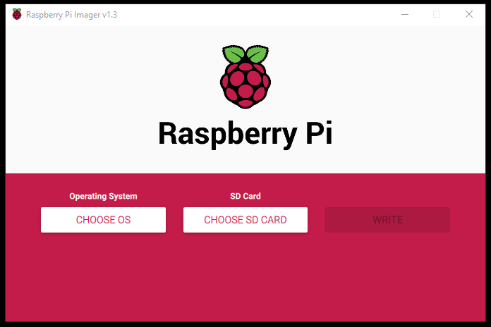
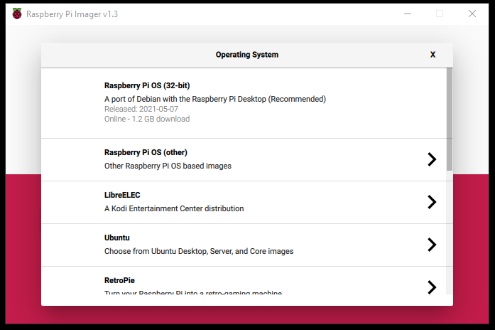
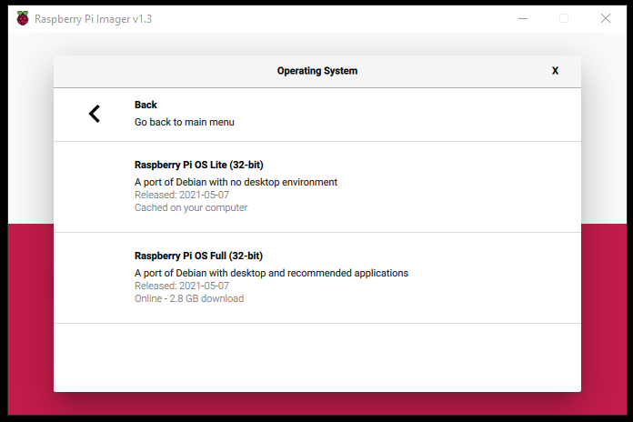
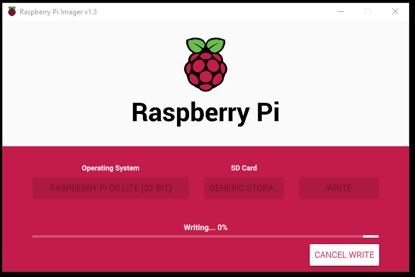
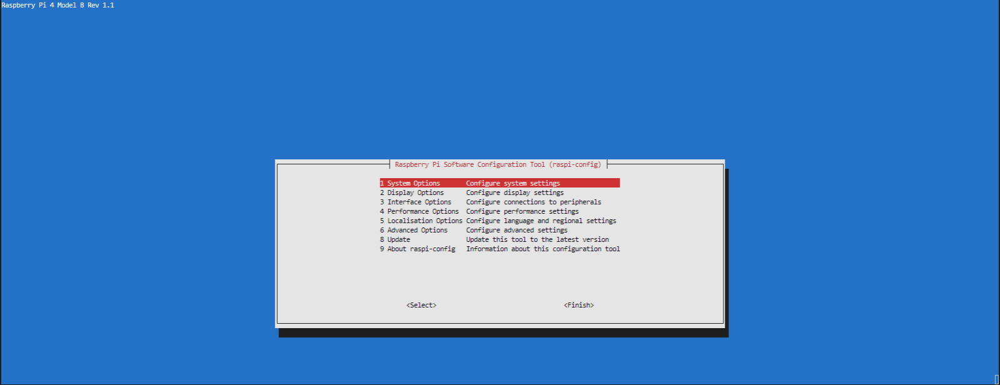

--- 
# Install and harden a headless RaspberryPi: From zero to hero 

Seja para projetos de IOT, seja para utilização um servidor web, ou para qualquer outra utilização que precise de um servidor unix completo, o Raspberry Pi é uma excelente plataforma para testes, experimentações e projetos. 

Eu utilizo a plataforma como a principal ferramenta de experimentação e prova de conceito antes de mover projetos para uma estrutura mais robusta. 

E em grande parte das situações, quando o escopo do projeto não é grande, o próprio Raspberry Pi é adequado para servir como o servidor de produção. 

Frequentemente, você pode querer rodar o Raspberry Pi em modo 'headless`, sem monitor ou teclado, utilisando SSH para se conectar diretamente a ele. 

O Raspberry Pi vem com a segurança baixa, por default. Se você estiver o utilizando em casa ou numa rede pequena, isso não é um grande problema, mas se você abrir suas portas para a internet, usá-lo como access point Wi-Fi ou se você o instalar em uma rede maior, você precisa tomar medidas de segurança para proteger seu Raspberry Pi. Neste guia, mostrarei tudo o que faço com os meus servidores Linux para mantê-los em segurança. 

Melhorar a segurança no Raspberry Pi é similar em qualquer outro dispositivo Linux. Há os passos lógicos, como utilizar uma senha forte. E também há os passos mais complexos, como detectar ataques ou usar criptografia. 

Vou compartilhar algumas dicas de segurança que você deve seguir para obter uma segurança maior para o seu Raspberry Pi (e quase todas elas se aplicam a qualquer distribuição Linux). Se você está só usando o seu Raspberry Pi em casa, tente ao menos aplicar as primeiras dicas, de segurança de contas de usuário, pelo ao menos. Siga todas as dicas incluídas para um setup mais robusto, para expor à internet ou a uma rede mais abrangente. 

Eu selecionei as dicas de segurança que se aplicam a todos que hospedam um Raspberry Pi e compartilham serviços nele. Eu utilizo a plataforma há vários anos, e estas são as dicas que eu aplico a qualquer nova instalação de servidor. 

Elas estão em ordem de nível de risco. Se você acha que está altamente exposto, siga todos os passos, e você estará seguro. 

Se o seu nível de risco não é muito grande, você só precisará seguir os primeiros passos. 

# Instalação
## Pré-requisitos

- Raspberry Pi  
- MicroSD Card (recomendado ao menos 16Gb, SD10)  
- Adaptador de cartão SD  
- Fonte de energia compatível com seu modelo de Raspberry Pi  

## Faça o download e a gravação da imagem

Faça o download do Raspberry Pi Imager no computador local, de acordo com o sistema operacional. O Imager está  disponível à partir da Raspberry Pi Foundation.

https://www.raspberrypi.com/software/

Após a instalação, lance o Imager e escolha a versão do sistema operacional clicando em `CHOOSE OS`. 



Na lista `Operating System`, clique na opção `Raspberry Pi OS (Other)` para escolher a instalação da versão do Raspberry Pi OS sem desktop. 



Escolha a primeira opção, `Raspberry Pi OS Lite (32-bit)`, assegurando-se que esta é a versão sem desktop (`"A port of Debian with no desktop environment"`). 



Escolha o cartão microSD que será gravado clicando em `CHOOSE SD CARD`. Em seguida, clique em `WRITE` para começar a gracação do sistema operacional no cartão.  



Acompanhe a instalação 

Ao fim da instalação, ejete o cartão SD e reconecte-o ao computador. 

## Configure wifi e acesso remoto

Conforme o seu sistema operacional, acesse o drive chamdo `boot`.

Para habilitar o acesso SSH, crie um arquivo vazio chamado `ssh`: 

```sh
$ touch ssh 
``` 

Ainda dentro do diretório `/boot`, crie um arquivo `wpa_supplicant.conf` e cole o conteúdo abaixo: 

```
country=ca
update_config=1
ctrl_interface=/var/run/wpa_supplicant

network={
 scan_ssid=1
 ssid="MyNetworkSSID"
 psk="Pa55w0rd1234"
}
```

Altere os campos `ssid` e `psk` para os valores da sua rede local. 

Insera o cartão no Raspberry Pi, espere alguns minutos até o sistema inicializar, e faça o seu primeiro logon com o usuário default da distribuição Raspberry Pi OS. 

`ssh pi@raspberrypi`

A senha do usuário default é `raspberry`. 

Caso o device não seja localizado, verifique as alternativas para descobrir um Raspberry Pi em uma rede local no [Descubra o endereço IP do seu Raspberry Pi](./LocateRaspberryPiNetwork.md). 

## Realize a atualização inicial do Raspberry Pi 

É preciso atualizar a distribuição: aplicar patches de segurança, melhorias etc desde que a imagem do SO foi gerada. 

Operação demorada, pode levar mais de 30 min dependendo do modelo de RPi que você possua. Tome um café. 


```sh
$ sudo apt-get update 
$ sudo apt-get full-upgrade -y 
$ sudo apt-get dist-upgrade -y
$ sudo apt-get clean 
$ sudo apt autoremove 
```

Verifique o script [update-server.sh](./scripts/update-server.sh) para um exemplo de script de atualização que pode ser incluído na schedule via cron para sua execução cíclica. 

## Altere o seu `hostname`

Um hostname é usado para identificar o seu servidor usando um nome fácil de se lembrar. Ele pode ser descritivo ou estruturado (detalhando para que o sistema é usado) ou pode ser uma palavra ou frase genérica. Veja alguns exemplos: 

- `Descritivo e/ou estruturado`: `web`, `staging`, `blog`, ou algo mais estruturado como [proposito]-[numero]-[ambiente], p.ex. `web-01-prod`. 
- Genérico ou séries: Tal como o nome de frutas (`maça, melancia`), rios (`amazonas, saofrancisco, xingu`), planetas (`mercurio, venus`), etc. 

O hostname pode ser usado como parte de um `FQDN (fully qualified domain name)` para o seu sistema (p.ex.: `web-01-prod.seusite.com.br`).

Neste guia alteraremos o nome do host para `dev-01-secpi`. 

```sh 
# hostnamectl set-hostname <nome do servidor>
$ hostnamectl set-hostname dev-01-secpi
```

Altere o arquivo `/etc/hosts` para incluir o novo hostname. Por exemplo: 

```
127.0.0.1        localhost    dev-01-secpi
192.168.1.100    dev-01-secpi
```

Após você ter feito estas alterações, você precisa fazer `logout` e fazer login novamente para ver o prompt do seu terminal mudar de `raspberry` para seu novo hostname.  O comando `hostname` assim como o comando `hostnamectl` também devem mostrar corretamente o seu novo hostname. 

## Configure os defaults de localização do sistema

Para realizar a configuração dos defaults do sistema operacional, basta utilizar o comando `raspi-config`.

```sh
$ sudo raspi-config
```



Entre nas opções seguintes e configure conforme as suas preferências:

```
5 - Localisation  
    L1 - Locale  
    L2 - Timezone  
    L3 - Keyboard  
    L4 - Wireless country  
```

# Assegure as contas de acesso ao sistema 

O acesso ao sistema se dá por meio de contas de usuários que devem ser geridas e acompanhadas. 

Como nós lidaremos com a criação de usuários e com a troca de senhas, é recomendável o uso de um programa de gestão de senhas, como Keepass ou equivalente. No mínimo, mantenha um caderno de log para registrar os dados dos seus servidores, seus usuários, senhas, etc.


## Crie um novo usuário 

O usuário default `pi` é inseguro porque ele é conhecido amplamente. Muitas tentativas de invasão de sistema começam exatamente explorando os usuários default dos sistemas. 

Para o nosso guia de exemplo nós criaremos um usuario chamado `secpi`. 

```sh
$ sudo adduser secpi        # vai pedir a criação de uma nova senha. Para os outros campos, digite enter para aceitar o branco. 
pi@dev-01-secpi:~ $ sudo adduser secpi
Adding user 'secpi' ...
Adding new group 'secpi' (1001) ...
Adding new user 'secpi' (1001) with group 'secpi' ...
Creating home directory '/home/secpi' ...
Copying files from '/etc/skel' ...
New password: 
Retype new password:
passwd: password updated successfully
Changing the user information for secpi
Enter the new value, or press ENTER for the default
        Full Name []:
        Room Number []: 
        Work Phone []:
        Home Phone []:
        Other []:
Is the information correct? [Y/n] Y

$ sudo adduser secpi sudo   # adiciona o usuário secpi ao grupo de sudoers 
Adding user 'secpi' to group 'sudo' ...
Adding user secpi to group sudo
Done.

# adiciona secpi a outros grupos de administrador
$ sudo usermod -G adm,dialout,cdrom,sudo,audio,video,plugdev,games,users,input,netdev,spi,i2c,gpio secpi 
```
Guarde a senha do usuário recém criado. Após a execução destes comandos, o novo usuário `secpi` está criado, os acessos de administração estão concedidos e um novo diretório *home* está disponível em `/home/secpi`. 

Faça logout du usuário `pi`, e em seguida refaça login com o usuário recém criado, `secpi`. 

```sh
$ logout 
```

Ao refazer o logon com o usuário `secpi`, teste o acesso de administrador do usuário: 

```sh
secpi@dev-01-secpi:~ $ sudo su

We trust you have received the usual lecture from the local System
Administrator. It usually boils down to these three things:

    #1) Respect the privacy of others.
    #2) Think before you type.
    #3) With great power comes great responsibility.

[sudo] password for secpi:
root@dev-01-secpi:/home/secpi# 
```

Se tudo correr bem, o sistema fará uma primeira exortação sobre segurança, e transformará o shell do usuário em super-usuário (`root@dev-01-secpi`). Saia do usuário `root` com o comando 

```sh
$ exit 
```

Desta forma, podemos proceder à supressão do usuário default `pi`. 

## Apague o usuário default `pi` 

Execute o comando abaixo para fazer a supressão do usuário default `pi`: 

```sh
$ sudo deluser -remove-home pi  # remove o usuario e o seu home
Looking for files to backup/remove ...
Removing files ...
Removing user 'pi' ...
Warning: group 'pi' has no more members.
??? como apagar o grupo ??? 
```

## Troque a senha do usuário `root` 

O usuário `root` tem privilégios elevados, e sua senha é de conhecimento público. Para assegurar sua conta, você deve alterar a senha do usuário `root`. 

```sh 
$ sudo passwd root
New password: 
Retype new password:
passwd: password updated successfully
```

Não se esqueça de manter um registro da senha do usuário `root` com seu método favorito. 
## Faça `sudo` exigir a senha do usuário

Em algumas instalações, a execução do comando `sudo` não pede que o usuário redigite a sua senha a cada uso. 

Edite o arquivo 
```sh
$ sudo nano /etc/sudoers.d/010_pi-nopasswd
```
Todos os usuários que tem poderes de sudo terão uma linha neste arquivo.  Substitua `secpi ALL=(ALL) NOPASSWD: ALL` com o seguinte `secpi ALL=(ALL) PASSWD: ALL`. 

# Configurações do SSH Server 

Por padrão, a autenticação de senha é usada para se conectar à sua instância de computação via SSH. 

Um par de chaves criptográficas é mais seguro porque uma chave privada substitui uma senha, que geralmente é muito mais difícil de descriptografar por força bruta. 

Nesta seção, criaremos um par de chaves e configuraremos seu sistema para não aceitar senhas para logins SSH.
## Reconfigure as chaves do servidor SSH

Reconfigure as chaves do servidor ssh apos uma reinstalacao.

As chaves criadas por default do ssh sao evidentes e simples de serem atacadas. A reconfiguraçao apaga as chaves fracas e recria um conjunto de chaves mais seguras.

Crie um diretorio de backup para guardar chaves antigas; mova as chaves para backup e as apague da configuração do servidor ssh: 

```sh
$ sudo mkdir /etc/ssh/oldkeys
$ sudo cp /etc/ssh/ssh_host* /etc/ssh/oldkeys
$ sudo rm -rf /etc/ssh/ssh_host*
```

Reconfigure as chaves do servidor ssh: 

```sh
$ sudo dpkg-reconfigure openssh-server
Creating SSH2 RSA key; this may take some time ...
3072 SHA256:/WXZpkr916D+F.....bofbz5965ntcaLyw6DM12fs root@dev-01-secpi (RSA)
Creating SSH2 ECDSA key; this may take some time ...
256 SHA256:/32pA7VolFe9RS.....sKlNXj3ovLBYIthzg3KtzD+c root@dev-01-secpi (ECDSA)
Creating SSH2 ED25519 key; this may take some time ...
256 SHA256:NLhxYPYg/pYW/2.....XURB7SnCND8+0WYuyWAGPAO0 root@dev-01-secpi (ED25519)
rescue-ssh.target is a disabled or a static unit, not starting it.
```

Reinicie o servico ssh: 

```sh
$ sudo service ssh restart
```

No computador local, edite o arquivo ~/.ssh/known_hosts e apague as linhas com as chaves do Raspberry Pi, identificadas pelo seu endereço IP ou pelo seu hostname. 

## Impeça login do root via SSH 

Edite o arquivo `/etc/ssh/sshd_config` e localize a linha: 

```sh
#PermitRootLogin prohibit-password  
```
Descomente a linha e salve o arquivo. Restarte o servidor SSH: 

```sh
$ sudo service ssh restart
```

## Exija ssh-keys para fazer login  

### Crie nova chave para acesso sem senha 

No Raspberry Pi, verificar se o diretório `.ssh` já existe com as autorizações corretas de acesso. Caso negativo, crie o diretório e atribua as autorizações necessárias: 

```sh
$ mkdir /home/secpi/.ssh
$ chmod 700 /home/secpi/.ssh
```

A partir do computador de onde você irá se conectar ao RPi headless, crie uma nova chave ssh para o acesso sem senha (supondo que você utilize Linux ou Mac): 

```sh 
$ ssh-keygen -t rsa -b 4096 -f secpi_id_rsa
```

Este comando gera um novo par de chaves `RSA` de 4096 bits e atribui o nome `id_rsa`.  

Você deve ter agora pelo ao menos dois arquivos lá. Uma que termina com `id_rsa.pub`e outra que termina com `id_rsa`. 

Para verificar, rode o comando seguinte: 

```sh 
$ ls ~/.ssh
```

### Instale a chave pública no Raspberry Pi 

Copie a chave pública gerada para o Raspberry Pi para o diretório `~/.ssh`. 

```sh
$ #scp ~/.ssh/id_rsa.pub secpi@secpi:/home/secpi/.ssh/authorized_keys
$ ssh-copy-id -i ~/.ssh/id_rsa.pub secpi@secpi-ip-address
/usr/bin/ssh-copy-id: INFO: Source of key(s) to be installed: "/c/Users/julio/.ssh/secpi_id_rsa.pub"
The authenticity of host 'dev-01-secpi (192.168.1.174)' can't be established.
ECDSA key fingerprint is SHA256:/32pA7VolFe9RSgfXg+sKlNXj3ovLBYIthzg3KtzD+c.
Are you sure you want to continue connecting (yes/no/[fingerprint])? yes
/usr/bin/ssh-copy-id: INFO: attempting to log in with the new key(s), to filter out any that are already installed
/usr/bin/ssh-copy-id: INFO: 1 key(s) remain to be installed -- if you are prompted now it is to install the new keys
secpi@dev-01-secpi's password: 

Number of key(s) added: 1

Now try logging into the machine, with:   "ssh 'secpi@192.168.1.174'"
and check to make sure that only the key(s) you wanted were added.
```

Um arquivo chamado `authorized_keys` foi criado no diretório `.ssh` do seu usuário. Este arquivo é a chave pública que acabou de ser criada. 

### Desabilite a autenticação por senha 
Usar autenticação baseada em senha é perigoso, especialmente se você planeja expor o Raspberry Pi em uma rede pública, como a internet. Por isso, você deve desabilitar a autenticação ssh e usar 
Esta etapa garante que não seja possível fazer logon sem o uso do par de chaves, inibindo toda tentativa de logon com a utilização de usuário. 

Edite o arquivo `sshd_config`: 

```sh
$ sudo nano /etc/ssh/sshd_config
```

Localize as linhas seguintes e as altere como abaixo. Se elas existirem, verifique que o conteúdo é idêntico; se elas estiverem comentadas, descomente-as; se elas não existirem, adicione-as ao fim do arquivo. 

```
PermitRootLogin no
PasswordAuthentication no
PermitEmptyPasswords no
ChallengeResponseAuthentication no
UsePAM no
```

Recarregue o daemon SSH para que as alterações tenham efeito

```
$ sudo systemctl reload ssh 
```

Agora, verifique que o acesso com senha está bloqueado. Deslogue do raspberry pi e tente relogar com o uso de senha: 
	
```
$ ssh secpi@secpi-ip-address -o PubKeyAuthentication=no
```
Você deve receber a mensagem de erro `Permission denied (publickey)`. 

### Determine quais usuários podem fazer logon via ssh e quais estão proibidos (whitelist / blacklist)

Para criar uma lista de permissão / proibição de logon via ssh ao sistema, edite o arquivo `/etc/ssh/sshd_config`. 

Na linha `AllowUsers` inclua os usuários que são permitidos a fazer login ao sistema. 

Na linha `DenyUsers` inclua os usuários que não são permitidos no sistema. 

Por exemplo: 

```
AllowUsers secpi 
DenyUsers pi root 
``` 

Estamos autorizando o logon de `secpi` e proibindo o logon de `pi` e de `root`. 

Após edição do arquivo, salvar e reiniciar o daemon SSH 

```
$ sudo systemctl restart ssh 
```

### Opcional 1: configure o SSH no cliente para acesso fácil 

Depois de configurar e instalar as chaves ssh entre o seu computador e o Raspberry Pi, você é capaz de se conectar via SSH sem utilização de senha. 

Agora, para o uso simplificado, sem ter que se lembrar do ip, do usuário, você pode definir um alias para acessar via ssh. 

Para isso, crie um arquivo `config` no diretório `~/.ssh` e inclua o conteúdo seguinte, substituindo nos locais apropriados os valores das variáveis. 

```sh
# Formato geral: 
# Host <alias> <host-ip-address>
#    HostName <hostname>
#    IdentityFile <~/.ssh/id_rsa>
#    User  <username>

# Configuração do servidor alias=secpi, disponível no IP 192.168.1.100, logando com usuário secpi
Host secpi 192.168.1.100
     HostName dev-01-secpi
     IdentityFile ~/.ssh/id_rsa
     User  secpi
```

Salve e feche o arquivo, a partir de agora você é capaz de se conectar ao seu Raspberry Pi via SSH com toda a segurança, digitando apenas 

```sh
# ssh alias
$ ssh secpi
```

### Opcional 2: mude a porta default do SSH (não é realmente efetivo)

É inefetivo pois um simples nmap na máquina revela o serviço e a porta não standard. 

Edite o arquivo `/etc/ssh/sshd_config`, e ache a seção seguinte: 
``` 
Port 22 
``` 
substitua por um outro número de porta que esteja disponível no servidor: 
```
Port 1111 
```

Reinicie o servidor: 
```
sudo service ssh restart 
```

Atualize as definições da porta no firewall. 

Antes de fechar a sessão atual, abra outro terminal e tente se conectar à nova porta. 

# Remova elementos não necessários do sistema

Ao remover os elementos não necessários do seu sistema, i.e., aplicações, protocolos, programas, serviços, dependências, etc... de modo a diminuir a `superfície de ataque` disponível para ser explorada por atacantes do seu sistema. 

#TODO : descrever o conceito de superfície de ataque. 
## Remova programas desnecessários (coisas que são inutilidades)
 
#TODO : Justificar a remoção dos programas

```sh
$ df -h     # tome nota do espaço utilizado na sua partição /dev/root 

Filesystem      Size  Used Avail Use% Mounted on
/dev/root        14G  4.1G  9.4G  31% /
devtmpfs        1.8G     0  1.8G   0% /dev
tmpfs           1.9G     0  1.9G   0% /dev/shm
tmpfs           1.9G   17M  1.9G   1% /run
tmpfs           5.0M   20K  5.0M   1% /run/lock
tmpfs           1.9G     0  1.9G   0% /sys/fs/cgroup
/dev/mmcblk0p1  253M   50M  203M  20% /boot
tmpfs           384M     0  384M   0% /run/user/1001

$ sudo apt-get remove --purge --assume-yes  \
scratch* \
libreoffice* \
wolfram-engine* \
sonic-pi \
minecraft-pi 

#sudo apt-get remove --purge --assume-yes scratch* libreoffice* wolfram-engine* sonic-pi minecraft-pi 
$ df -h    # compare com o espaço que você havia anotado e admire o espaço liberado! A diferença é o espaço total ganho nesta ação de liberação de espaço. 
 
```

## Remova serviços desnecessários ou inseguros 

#TODO : Justificar a remoção dos serviços

Liste os serviços que estão rodando: 

```sh
sudo service --status-all 
```

Para parar um serviço: 
```sh
sudo service <service-name> stop 
```

Para iniciar um serviço: 
```sh
sudo service <service-name> start 
```

Se o serviço reinicia automaticamente no boot, tente: 
```sh
sudo update-rc.d <service-name> remove
``` 

Para desinstalar o serviço: 
```sh
sudo apt remove <service-name>
```

## Remova os protocolos desnecessários ou inseguros 

#TODO : Justificar a remoção dos programas

Troque os protocolos fracos pour outros melhores : 
http ==> https
telnet ==> ssh 
ftp ==> sftp

```
$ sudo apt-get remove telnet tftp ftp 
$ sudo apt-get autoremove
```

# Instale um firewall 

Um firewall que funcione corretamente é a parte crucial de uma configuração completa de segurança de um sistema Linux. 

Por default, as distribuições Ubuntu e Debian vem com uma ferramenta de configuração de firewall chamada `UFW (Uncomplicated Firewall)`, que é a ferramenta mais popular e de utilização simples para configuração e gestão de firewall no Linux. O UFW roda em cima de iptables, incluído na maioria das distribuições Linux. 

Ele fornece uma interface simplificada para configurar casos de uso de firewall comuns por meio da linha de comando.

O Raspbery Pi OS não inclui o UFW instalado na distribuição, então inicialmente devemos isntalá-lo. 

```sh
$ sudo apt-get install ufw 
```

Após a instalação, o firewall está desabilitado por default.  

Você pode checar o status do UFW com o comando abaixo, e deverá receber como resposta `Status: inactive`. 

```sh
$ sudo ufw status verbose 
Status: inactive
```

Devemos então habilitar o firewall com o comando seguinte, que também o ativará após reinicialização no boot. 

```
$ sudo ufw enable
Command may disrupt existing ssh connections. Proceed with operation (y|n)? y
Firewall is active and enabled on system startup
```

Se precisarmos desativar o firewall por algum motivo, a opção disable vai desabilitar o firewall e o impedirá de ser ativado após a reinicialização no boot. 

## Regras default do UFW

Por default, o UFW bloqueia toda conexão entrando e somente permite as conexões saindo do servidor. Isso significa que ninguém pode acessar seu servidor, a menos que você abra especificamente a porta, enquanto todos os serviços ou aplicações no seu servidor serão capazes de acessar a rede externa. 

As regras default do UFW estão no arquivo `/etc/default/ufw`.

## Uso básico do UFW

**Listar perfis de aplicação disponíveis** : 
```sh
$ sudo ufw app list 
```

**Habilitar um perfil de aplicação** : 
```sh
$ sudo ufw allow "OpenSSH"
Rule added
Rule added (v6)
```

**Permitir toda conexão http** :  
```sh
$ sudo ufw allow http    # ou sudo ufw allow 80  
Rule added
Rule added (v6)
$ sudo ufw allow https   # ou sudo ufw allow 443   
Rule added
Rule added (v6)
```

**Bloquear o envio de email**  
```sh
$ sudo ufw deny out 25  
Rule added
Rule added (v6)
```


## Sugestão de regras a serem utilizadas no UFW 

```sh
$ sudo ufw default allow outgoing  # permite todas as conexões entrando
Default outgoing policy changed to 'allow'
(be sure to update your rules accordingly)

$ sudo ufw default deny incoming   # nega todas as conexões saindo 
Default incoming policy changed to 'deny'
(be sure to update your rules accordingly)

$ sudo ufw allow ssh               # permite o serviço ssh (porta default 22)
Rule added
Rule added (v6)
```


Para mais detalhes de utilização do UFW, por favor veja a [página man UFW](http://manpages.ubuntu.com/manpages/bionic/man8/ufw.8.html), ou no sistema Linux pelo comando 

```sh
man ufw 
```


# Check os logs regularmente

A administração do sistema supõe que os logs sejam lidos e acompanhados para 

`/var/log/syslog`:   Log file principal para todos os serviços 
`/var/log/message`:  Log file de mensagens.
`/var/log/auth.log`: Todas as tentativas de autenticação se encontram aqui. 
`/var/log/mail.log`: Logs das mensagens de email 
Procure consultar também os arquivos de log de todas as suas aplicações críticas, como por exemplo do Apache Webserver `/var/log/apache2/error.log` ou  do MySQL Server`/var/log/mysql/error.log`.
 
Atividade extra: instale uma solução de agregação de dados e integre todos os logs dos seus sistemas neles, como o `ELK Stack` ou `Splunk`. 

# Proteja o acesso físico ao Raspberry Pi

A segurança física é uma prática vital para impedir que pessoas não autorizadas entrem em sua casa ou empresa e causem danos, proteger sua propriedade intelectual contra espionagem corporativa e mitigar a violência no local de trabalho, entre outras preocupações. Uma forte estratégia de segurança cibernética protege os dados confidenciais que os sistemas físicos retêm.

Em termos de cibersegurança, o objetivo da segurança física é minimizar esse risco aos sistemas de informação e à informação. Portanto, o acesso a sistemas, equipamentos e ambientes operacionais deve ser limitado apenas a indivíduos autorizados. 

No momento em que um dispositivo é conectado à rede, ele se torna uma possível superfície de ataque para um hacker alcançar a rede. Eles podem implantar malware, roubar dados ou causar estragos que interrompem as operações de negócios, causam a perda de sistemas, etc. Cada dispositivo conectado à IoT usado em sua casa ou sua organização deve ser devidamente protegido para evitar que isso aconteça.

# Esteja em dia com as notícias de segurança e as bases de vulnerabilidade

[CVE Details](https://www.cvedetails.com/)  
[Exploit DB](https://www.exploit-db.com/)  
[NVD Feeds](https://nvd.nist.gov/vuln/data-feeds)  
[The Hacker News](https://thehackernews.com/)  


# Boas práticas 

- Tenha um registro onde salvar as informações relevantes da configuração, `ServerLog`. Nome de servidor, endereços IP, senhas do usuário e de aplicativos. 
  Faça o registro em um gestor de configuração, em um gestor de senhas, ou ao menos em um caderno offline. 
- Não use auto-login nem senhas vazias; 
- Prefira passphrases com strings longas - são mais fáceis de se lembrar, e mais difíceis de serem quebradas. Veja [correct horse battery staple](https://xkcd.com/936/). 
- Acompanhe as notícias sobre vulnerabilidades e exploits, e aja caso seu sistema for afetado


---
---
---
---


# Install fail2ban 

sudo apt install fail2ban

sudo nano /etc/fail2ban/jail.conf

sudo service fail2ban restart


# Backup your data 

# Crypt your connections 


# Use a VPN 

