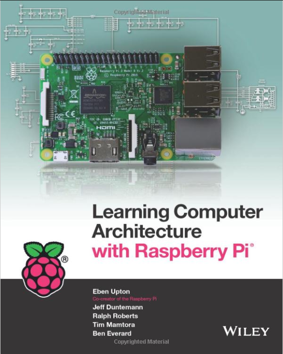

--- 
# RaspberryPi
Repositório de knowledge-base sobre o Raspberry Pi. 

# [Instalação do sistema operacional e hardening de um RPi headless](./InstallHarden.md)

# [Français - Installation et sécurisation d'un Raspberry Pi `headless`: de zero à hero ](./fr-InstallHarden.md)

# [Localização de um RPi na rede local](./LocateRaspberryPiNetwork.md)

# [Instalação de programas, utilitários e linguagens de programação ](./ProgramsUtilities.md)

# [Referências](./References.md)

Uma das minhas referências preferidas é o livro [Learning Computer Architecture with Raspberry Pi, de Eben Upton](https://www.wiley.com/en-us/Learning+Computer+Architecture+with+Raspberry+Pi-p-9781119183938), co-criador do Raspberry Pi. 

